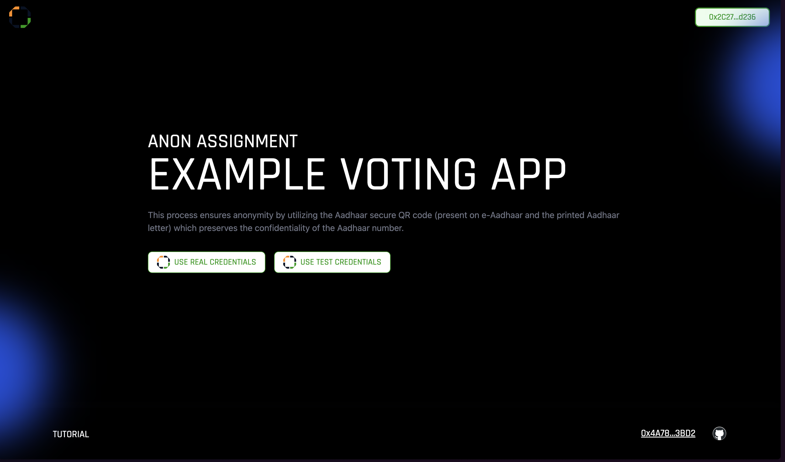

# Anon Aadhaar Updated UI 

<!-- add an image -->


This is an example app showing how to integrate the [Anon Aadhaar](https://github.com/anon-aadhaar/anon-aadhaar).

You can check the documentation [here](https://documentation.anon-aadhaar.pse.dev/)

You can fork/clone it.

To run it locally you'll need to add some env variables. You can copy the `.env.local.example` to a `.env.local` file.

```bash
# RPC URL
NEXT_PUBLIC_RPC_URL=
# Address of deployed Anon Aadhaar 
NEXT_PUBLIC_ANON_AADHAAR_CONTRACT_ADDRESS=6bE8Cec7a06BA19c39ef328e8c8940cEfeF7E281
# Address of the vote contract address with production key of UIDAI (for using with real Aadhaars)
NEXT_PUBLIC_VOTE_CONTRACT_ADDRESS_PROD=221745DCe3a550fbe1a65A07d3882d9065EC4a83
# Address of the vote contract address with test key (for using test QRs)
NEXT_PUBLIC_VOTE_CONTRACT_ADDRESS_TEST=4a78D2C4CC758Ae9B441bA18448A902FFA523BD2
# WalletConnect API key
NEXT_PUBLIC_PROJECT_ID=
# Your wallet private key, used only in deployin contracts
PRIVATE_KEY=
```

### Install

```bash
yarn install
```

### Start

```bash
yarn dev
```

### Test

```bash
cd contracts
npx hardhat test
```
